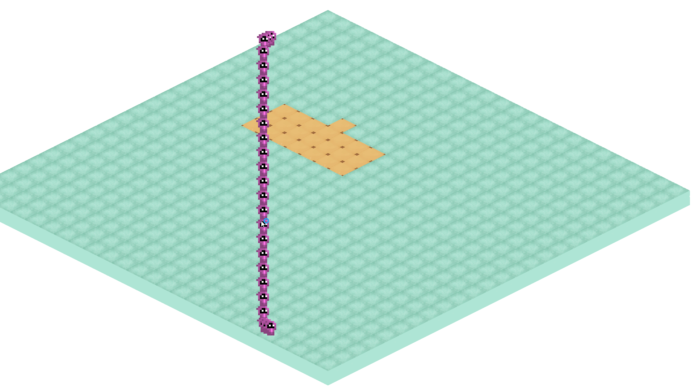
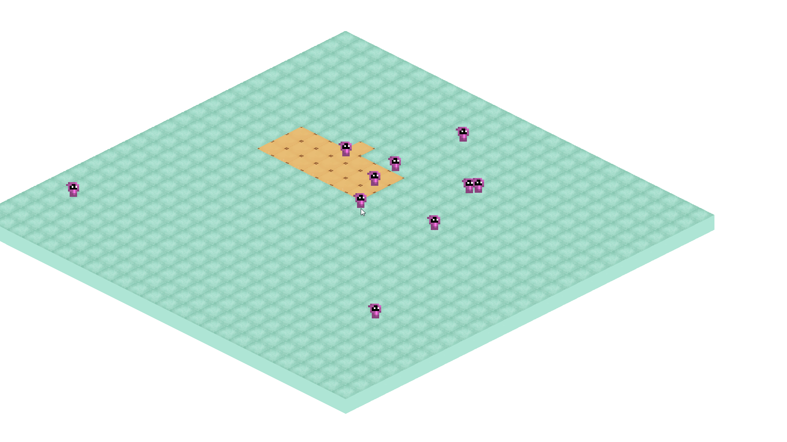

# KEEPER

### An Undertaking of a Turn-Based Combat World Simulation

- The primary goal of KEEPER is to learn new things
- The secondary goal of KEEPER is to produce something of a combination between Wakfu and a world simulation
- Isometric because isometric wins
- Making my own engine for the sake of learning what it requires me to do
    - Data Oriented Entity Component System (Multithreading WIP)
- Built on top of the SDL2 framework with---currently---no other dependencies

# TODO
- [x] Worker threads that await jobs in the ECS
    - [ ] Fix race condition relating to coordinator entities
- [x] Add render layer batching so things stop looking wonky
- [ ] Add awareness of nearby entities to entities with CAIController
- [ ] Boid alg and some sort of CFlock struct to store relevant data
- [ ] Create node system to chunkify world map for A* pathfinding

## v0.0.3 - Render Layer Batching

## v0.0.2 - A* Pathfinding

## v0.0.1 - Basic ECS and Tiles

